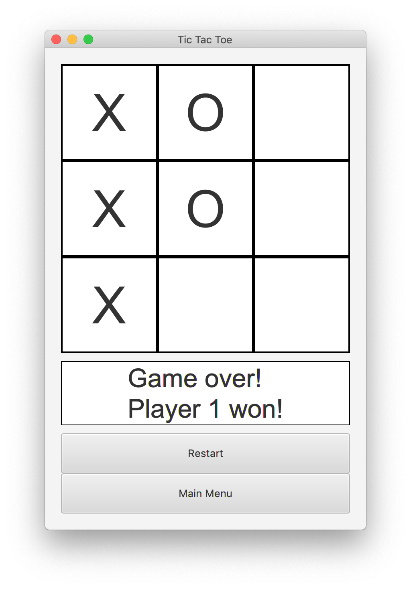

[](https://travis-ci.org/AshleyByeUK/tictactoe-java-core)
[](https://codecov.io/gh/AshleyByeUK/tictactoe-java-core)

# tictactoe-java-core

## Introduction

A game of TicTacToe that can be played in the console r graphical user interface. Features include Human vs Human,
Human vs Computer and Computer vs Computer modes. The computer player can be configured for easy and hard difficulties.




## Requirements

This project was written using OpenJDK 11. To run this project, you will need to have a compatible version of the
JDK installed. The JDK can be obtained from the following links:

- [OpenJDK 11](https://jdk.java.net/11/)

You can also use your operating system's native or third-party package managers to obtain the JDK. Whilst this game 
has not been tested with older versions of Java, you may find that versions as old as JDK 8 are sufficient.

## To Play

There are several ways that you can play TicTacToe. First, you'll need to clone this repository:

`git clone git@github.com:AshleyByeUK/game-java-core.git`

You can then use Gradle to run the game or to build a JAR file. The following sections explain how to do this and
assume you are in the root directory of the project.

### Run with Gradle

To run with Gradle, execute the following command:

`./gradlew --console plain run console`

You can omit the `--console plain` flag, but you will have to put up with Gradle build information being displayed
in the user interface. This is also quite slow and game play is jittery.

### Run as a JAR file

To build a JAR file, execute the following command:

`./gradlew jar`

This will build a JAR file in the root directory of the project. You can then run the JAR file as follows:

`java -jar out/game.jar [console]`

Game play using this method is much smoother.

## Testing

The test suite includes long running tests. These are enabled in the Gradle `testSlow` task.

For example, execute all tests, including long running tests with Gradle:

```
./gradlew testSlow
```

Conversely, to execute all tests, excluding long running tests with Gradle:

```
./gradlew test
```

It can also generate code coverage reports:

```
./gradlew test jacocoTestReport
```

Test reports are generated in both XML and HTML format and are located in the following directory, relative to the
project root directory:

```
build/reports/jacoco/test
```

To open the HTML test reports, type the following (on macOS):

```
open build/reports/jacoco/test/html/index.html
```

## Cleaning Up

You can clean up the files and directories created by Gradle with the following command:

`./gradlew clean`
